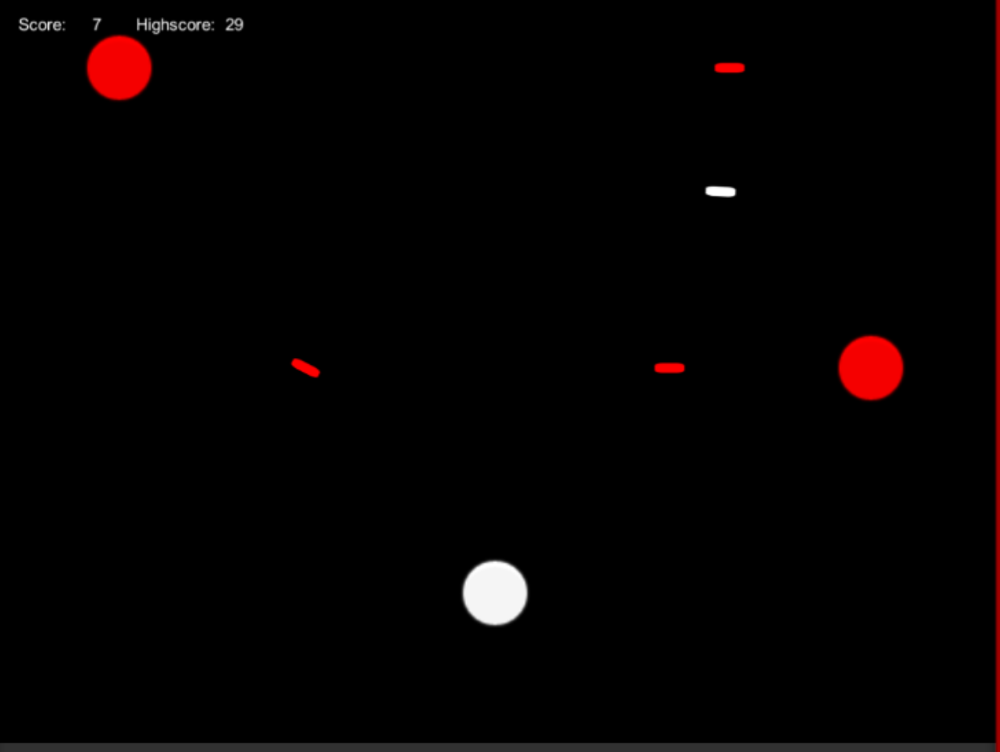

# Infinite Vertical Scroller
---
Unity project containing vertical scroller game

 

## Getting Started
---
### Prerequisites

* Unity installed

### Installing

Download project and open with Unity

## Controls
---
* Press space bar to move up
* Release space bar to fall back
* Player Autofires on enemies
* Press R to restart

## Notes
---
* Example of nearest neighbour searching using KD trees
* Object pooling script

## Tested Versions
---
### Unity Versions - windows standalone platform

* 2017.4.22
